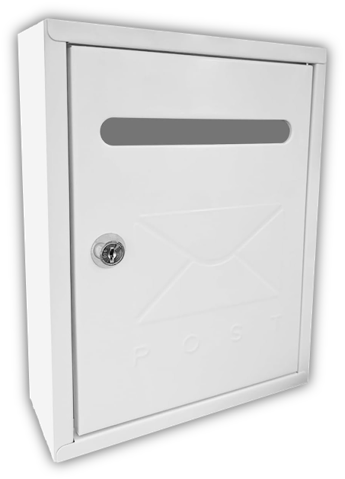
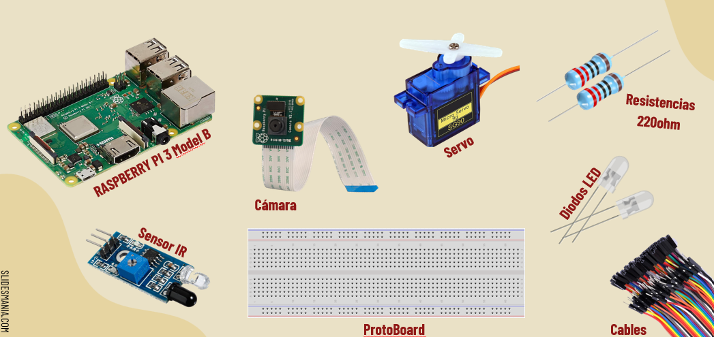
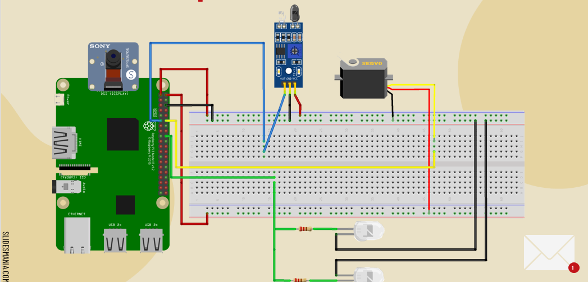
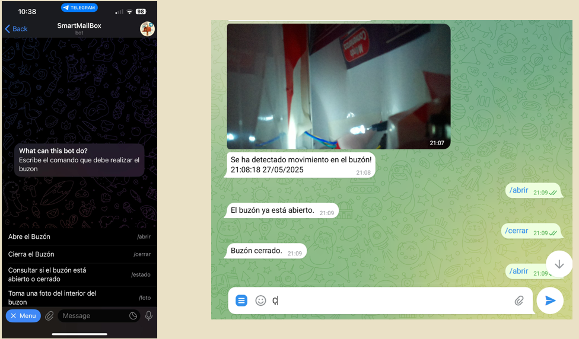

# 📬 Smart Mailbox – Intelligent Letter Detection and Notification System

This project presents a **Smart Mailbox** system designed to detect the arrival of physical letters and notify the user in real time using a Telegram bot. It integrates sensors, a camera, and servo-controlled locking mechanisms, offering full remote control and monitoring from any device via Telegram.

All functionalities have been implemented using a **Raspberry Pi 3 Model B**, which acts as the central controller for all hardware and software operations.

---

## 🔧 How It Works

- An **infrared (IR) sensor** is placed inside the mailbox to detect interruptions. When the IR beam is broken, the system recognizes that a **letter has been inserted**.
- Once detected:
  - A **camera** takes a photo of the inside of the mailbox.
  - Several **LEDs** act as a flash to ensure the picture is clear, even in low light.
  - The image is **sent via Telegram** to the user as a notification.
- Users can also **request a real-time photo** of the mailbox’s contents at any time through the Telegram bot.
- A **servo motor** is used to open or close the mailbox's lock remotely.
- All commands and functions are accessible via **custom Telegram bot commands**.

---

## 💬 Telegram Bot Features

The Telegram bot supports the following commands:

- `/foto` → Takes and sends a live photo from inside the mailbox.
- `/abrir` → Unlocks the mailbox using the servo-controlled lock.
- `/cerrar` → Locks the mailbox again.
- `/estado` → Returns the current lock state and sensor readings.
- Automatic notifications when new mail is inserted (with image attached).

---

## 🖼️ Project Images

### 📦 Mailbox Hardware

### 🧰 Required Components

### 🔌 Wiring Diagram

### 📱 Telegram Bot Interface

---

## 📡 Technologies Used

- **Raspberry Pi / Microcontroller (e.g., ESP32 or Arduino)**
- **Infrared sensor**
- **Camera module**
- **High-intensity LEDs**
- **Telegram Bot API**
- **Servo motor**
- **Python / Arduino C** (depending on the controller used)

---

## 👨‍💻 Authors

**Héctor Gordillo** & **Javier Fernández**

---

## 📎 Notes

This system is ideal for people who want to be notified in real time when new mail is delivered, or simply wish to monitor and control access to their physical mailbox remotely and securely.

---
